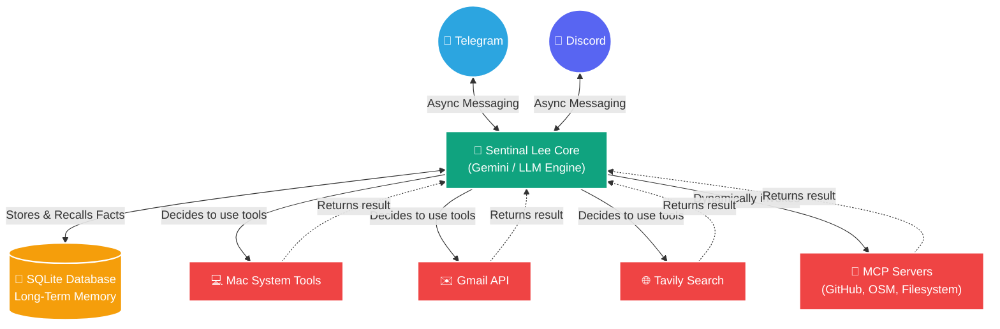

<div align="center">

# 🤖 Sentinal Lee — Personal AI Assistant

**A powerful, locally-hosted AI assistant that runs 24/7 on your Mac, built for ultimate privacy and deep system integration.**

[](https://python.org)
[](https://discord.com)
[](https://telegram.org)

*Warm, witty, and competent — Sentinal Lee is not just an assistant, he's your trusted companion.*

<br/>

**Built by Jananth Nikash K Y**
🌐 [www.jananthnikash.com](http://www.jananthnikash.com)
💼 [LinkedIn Profile](https://www.linkedin.com/in/jananth-nikash-k-y/)

</div>

---

## ✨ Features

Sentinal Lee is packed with features designed to make your life easier, all while running securely on your own hardware.

| Feature | Description |
|---------|-------------|
| 💬 **Telegram & Discord** | Chat with Lee directly through Telegram or Discord. **Owner-only security** ensures nobody else can use your bot. |
| 🧠 **Long-Term Memory** | Lee remembers your preferences, projects, and facts forever using a robust SQLite database. |
| ⚡ **Lightning Fast** | Powered by Gemini and OpenAI-compatible endpoints, Lee responds instantly and runs tools in parallel. |
| 🔧 **System Control** | Let Lee control your Mac — he can read/write files, open apps, create Reminders, and run shell commands. |
| 🔌 **MCP Plugin Ecosystem** | Supercharged via the Model Context Protocol (MCP)! Lee dynamically connects to external servers like **GitHub**, **OpenStreetMap**, **Filesystem**, and **Sequential Thinking**. |
| ✉️ **Gmail Integration** | Lee can read your unread emails and draft/send replies for you. |
| 🔍 **Web Search** | Live internet access via Tavily to answer up-to-date questions. |
| 📸 **Screenshots & Clipboard** | Lee can see your screen or read what you just copied. |
| 📈 **Indian Market Analysis** | Real-time NSE/BSE stocks, gold/silver prices in ₹, trend analysis and AI-driven suggestions. |

---

## 🚀 Quick Start Guide

### 1. Clone & Setup
First, get the code onto your Mac and install the requirements:

```bash
# Navigate to the project folder
cd ~/Desktop/Personal_AI_Assistant/Sentinal_Lee

# Create a virtual environment
python3 -m venv agentEnv

# Activate it
source agentEnv/bin/activate

# Install all the necessary packages
pip install -r requirements.txt
```

### 2. Configure Your Secrets (`.env`)
Create a file named `.env` in the `Sentinal_Lee` folder and add your specific keys. **Do not share this file with anyone!**

```env
# 1. API Keys
GEMINI_API_KEY=your_gemini_key
DISCORD_TOKEN=your_discord_bot_token
TELEGRAM_TOKEN=your_telegram_bot_token
TAVILY_API_KEY=your_tavily_key
INDIAN_API_KEY=your_indianapi_key

# 2. MCP Server Keys (Optional but powerful)
GITHUB_TOKEN=your_github_personal_access_token
# (Note: Filesystem, OpenStreetMap, and Sequential Thinking MCP servers run locally free without keys!)

# 3. Your Identity
AGENT_USER_NAME=YourName

# 4. Security (CRITICAL)
# Find your Telegram ID from @userinfobot
TELEGRAM_OWNER_ID=123456789
# Find your Discord ID by right-clicking your name in Developer Mode
DISCORD_OWNER_ID=987654321
```

### 3. Configure Google API Capabilities (Gmail Integration)
If you want Sentinel Lee to be able to read and send emails on your behalf, you need to set up Google API credentials:
1. Navigate to the `data/` folder.
2. You will see two template files: `credentials.example.json` and `token.example.json`.
3. Copy them and remove the `.example` part:
   ```bash
   cp data/credentials.example.json data/credentials.json
   cp data/token.example.json data/token.json
   ```
4. Fill in your real Google Cloud OAuth Client ID, Secret, and Tokens inside those new files. **These files are strictly ignored by `.gitignore` to prevent secret leaks, so you will never accidentally commit your real keys to GitHub!**

### 4. Start the Engine!
You can start Lee simply by running:
```bash
python main.py
```

He will instantly connect to Telegram and Discord in the background.

---

## 🖥️ Running 24/7 on Your Mac (Background Service)

For a proper always-on setup, use macOS's built-in **launchd** system. Lee is configured as a background service that:
- ✅ **Auto-starts** every time you log in
- ✅ **Auto-restarts** instantly if it ever crashes
- ✅ Uses `ProcessType=Background` — macOS deprioritizes it so it barely touches battery or CPU

### One-Time Setup
```bash
# 1. Copy the plist to LaunchAgents
cp com.sentinallee.plist ~/Library/LaunchAgents/

# 2. Load and start the service
launchctl load ~/Library/LaunchAgents/com.sentinallee.plist

# 3. Verify it's running (you should see the PID and 0 exit code)
launchctl list | grep sentinallee
```

### Day-to-Day Management
```bash
# View live logs (press Ctrl+C to stop)
tail -f logs/lee.log

# View error logs
tail -f logs/lee.error.log

# Stop the service
launchctl unload ~/Library/LaunchAgents/com.sentinallee.plist

# Start the service again
launchctl load ~/Library/LaunchAgents/com.sentinallee.plist

# Restart after a code update
launchctl unload ~/Library/LaunchAgents/com.sentinallee.plist && launchctl load ~/Library/LaunchAgents/com.sentinallee.plist
```

### 🔋 Battery Tips
- Lee is **event-driven** — it uses near-zero CPU when idle (it only wakes on a Telegram/Discord message).
- Set **System Preferences → Battery → Power Adapter → "Prevent sleeping when display is off"** to keep the Mac awake when plugged in.
- If unplugged, macOS will automatically suspend background processes to save power.

---

## 🧠 How Long-Term Memory Works
Lee is designed to be your constant companion. If you tell him a fact about yourself (e.g., *"I'm working on a Python project"* or *"My favorite food is sushi"*), he will permanently learn it. 

- He stores this in his SQLite brain (`data/Lee.db`).
- Every time you start a fresh chat, he recalls everything he knows about you automatically.
- To check what he remembers, just type `/memory` in Telegram or `!memory` in Discord.

---

## 🛠️ The Toolbelt
Lee uses advanced "function calling" to operate your computer. If you ask him to do something, he will select the right tool entirely on his own.

| Tool Name | What it does | Example of what you can say |
|-----------|--------------|-----------------------------|
| `get_system_info` | Checks your RAM, CPU, Battery | *"How is my Mac running?"* |
| `run_shell_command` | Runs terminal commands | *"List all the folders on my Desktop"* |
| `read_file` | Reads code or text | *"Read the config.py file"* |
| `write_file` / `append_file` | Creates or edits files for you | *"Write a quick python script for me"* |
| `set_reminder` | Interacts with Apple Reminders | *"Remind me to call Mom at 5pm"* |
| `open_url` | Opens links in Safari/Chrome | *"Open YouTube for me"* |
| `get_unread_emails` | Checks your Gmail inbox | *"Any new emails today?"* |
| `send_email` | Drafts and sends via Gmail | *"Email John and say I'll be late"* |
| `get_market_data` | Real-time stock and metal prices | *"What's the gold price today?"* |
| `get_top_news` | Today's news from the web | *"Give me today's top headlines"* |

---

## 🔌 The MCP Ecosystem (New!)
Sentinal Lee now supports the **Model Context Protocol (MCP)**, allowing him to connect securely to standardized external tool servers via standard I/O subprocesses.

Current active MCP integrations:
- 🗺️ **OpenStreetMap**: Renders map views and performs robust geocoding—completely free, no API keys needed.
- 🐈‍⬛ **GitHub**: Full repository, issue, and PR management directly from your chat (requires `GITHUB_TOKEN`).
- 📂 **Enhanced Filesystem**: Advanced computer control (recursive directory trees, surgical file edits, metadata reads) restricted safely to your allowed directories.
- 🧠 **Sequential Thinking**: A powerful chain-of-thought system that Lee invokes to logically break down and solve complex, multi-step tasks.

*MCP servers are spun up dynamically on boot via `npx`—adding a new massive suite of developer tools seamlessly without cluttering the core Python logic!*

---

## 🛡️ Privacy & Security First
Because Lee can run commands on your machine, strict security is built in:
1. **Owner-Only Bots**: The Discord and Telegram bots will completely ignore everyone except the IDs specified in your `.env` file.
2. **Headless Design**: The bot operates purely via chat APIs, entirely eliminating local web server vulnerabilities.
3. **Command Blocklist**: Destructive terminal commands (like `rm -rf /` or `shutdown`) are hard-blocked by the core engine.

---

## 🎛️ Behind the Scenes (Architecture)
Sentinal Lee is built on a highly concurrent AI pipeline:
- **AsyncIO gather**: Executes multiple tools in parallel (e.g. searching the web while simultaneously checking your system status).
- **SQLite FTS5**: Super-fast full-text search powers the conversation history.
- **Nvidia NIM API**: Currently optimized for `meta/llama-3.3-70b-instruct` to provide top-tier logic via standard OpenAI-compatible endpoints with excellent tool-calling support.

### System Flow


---

## 📊 Indian Market Analysis Engine

Sentinal Lee uses a **Pro-grade hybrid engine** to give you the most accurate Indian market data possible. With your **IndianAPI.in** key, Lee now has institutional-level access:

| Tier | Asset Type | Data Source | Why |
|------|-----------|-------------|-----|
| **1** | 🥈 **Pro Market Data** | **IndianAPI.in** (Official) | Gets official exchange prices for **both Stocks and Commodities** (Gold/Silver) |
| **2** | 📈 **Basic Stocks** | **NSE/BSE API** (No-Key) | Free real-time fallback for Indian stock prices |
| **3** | 🥇 **Retail Metals** | **Tavily Web Search** | Scrapes live "Jeweler's Board" prices from Indian news for retail accuracy |
| **4** | 🔍 **Deep Analysis** | **Analyst Views Endpoint** | Fetches official broker reports and targets for stock suggestions |

### What You Can Ask Lee
```
"What is the silver price trend this week?"
"Analyze HDFC Bank and give me the broker targets."
"What's the current price of 24k gold per gram in India?"
"Give me the NIFTY 50 trends for this week."
```

> **Note**: For stock suggestions, Lee uses the `get_indian_analysis` tool (powered by IndianAPI.in) to give you *professional-grade* recommendations — no hallucinations.

---

## 👨‍💻 Credits
**Sentinal Lee Architecture, Engineering, & Design**
Built by **Jananth Nikash K Y**

- 🌐 **Website**: [www.jananthnikash.com](http://www.jananthnikash.com)
- 💼 **LinkedIn**: [Jananth Nikash K Y](https://www.linkedin.com/in/jananth-nikash-k-y/)

---
<div align="center">
<i>"Why do it yourself when Sentinal Lee can do it for you?"</i>
</div>
